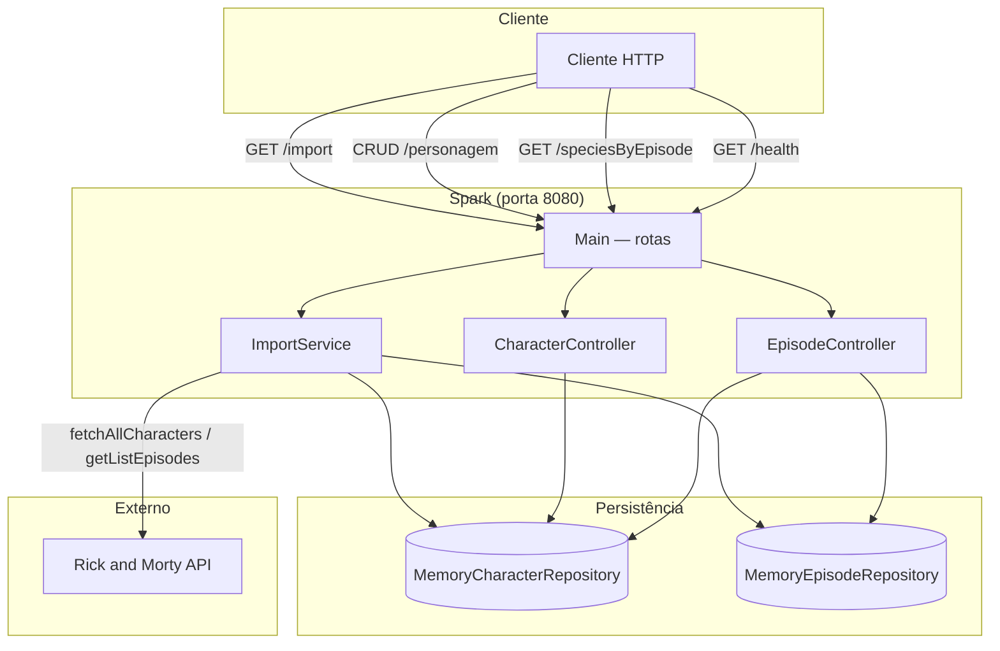
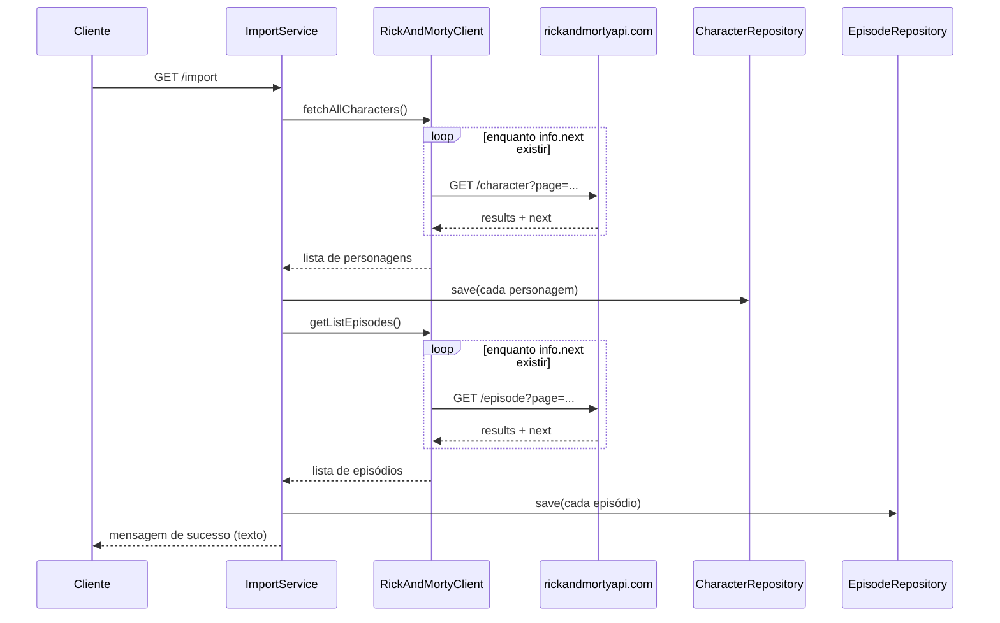

# Rick and Morty API — Backend Java (Spark)

API REST em **Java 11** com **Spark Java**, que espelha dados da [Rick and Morty API](https://rickandmortyapi.com/) em memória e expõe CRUD de personagens, importação em lote e um relatório de espécies por episódio.

Servidor padrão: `http://localhost:8080`

---

## Visão geral

| Item | Detalhe |
|------|---------|
| Framework HTTP | Spark Java 2.9.4 |
| Cliente HTTP externo | OkHttp → `https://rickandmortyapi.com/api` |
| JSON | Gson |
| Persistência | **Em memória** (`HashMap` estático nos repositórios) |
| Camadas | `Main` → controllers → services (importação) → repositories → models |

Os dados **não sobrevivem** a reinício do processo. Para popular o “banco”, chame `GET /import` antes de usar listagens ou o relatório.

---

## Fluxo da aplicação



### Fluxo de importação (`GET /import`)



### Fluxo do relatório (`GET /speciesByEpisode`)


---

## O que está implementado hoje

### Funcional

| Método | Rota | Descrição |
|--------|------|-----------|
| `GET` | `/health` | Health check — retorna `OK` |
| `GET` | `/import` | Importa todos os personagens e episódios da API externa para memória |
| `GET` | `/personagem?page=&size=` | Lista personagens com paginação (`page` padrão: 1, `size` padrão: 10) |
| `POST` | `/personagem` | Cria personagem (JSON no body); status `201` |
| `PUT` | `/personagem/:id` | Atualiza personagem pelo ID da URL |
| `DELETE` | `/personagem/:id` | Remove personagem; status `204` |
| `GET` | `/speciesByEpisode` | Relatório: contagem de espécies por episódio (requer import prévio) |

### Parcial ou ausente

| Item | Situação |
|------|----------|
| `GET/POST/PUT/DELETE /episodio` | `EpisodeController` tem apenas `listar` (fixo página 1, tamanho 20) e **não há rotas registradas** em `Main` |
| `PageResponse` | Modelo existe, mas a listagem de personagens retorna **array JSON** direto, sem metadados de página |
| `ImportController` | Classe existe com rotas duplicadas, mas **não é usada** — `Main` registra `/import` diretamente |
| Persistência em disco/BD | Não implementada — apenas repositórios em memória |

---

## Endpoints (referência rápida)

### `GET /import`

Dispara a sincronização com a API externa. Resposta em texto, por exemplo:

`Sucesso na importação: 826 personagens e 51 episódios`

Recomendação: executar uma vez após subir o servidor.

### `GET /personagem`

Query params opcionais: `page`, `size`.

Exemplo: `GET /personagem?page=1&size=10`

Resposta: array JSON de personagens (`id`, `name`, `status`, `species`, `episode`).

### `POST /personagem`

Body (exemplo):

```json
{
  "name": "Rick Sanchez",
  "status": "Alive",
  "species": "Human",
  "episode": []
}
```

Se `id` vier omitido, o repositório gera um ID sequencial.

### `PUT /personagem/:id`

Body com os campos do personagem; o `id` da URL sobrescreve o do body.

### `DELETE /personagem/:id`

Remove o registro; corpo vazio com status `204`.

### `GET /speciesByEpisode`

Retorna lista de objetos com `episodeId`, `name`, `episodeCode` e `speciesCount` (mapa espécie → quantidade), agregando personagens vinculados a cada episódio importado.

---

## Modelos principais

- **Character** — `id`, `name`, `status`, `species`, `episode` (URLs dos episódios)
- **Episode** — `id`, `name`, `episode` (código, ex. `S01E01`), `characters` (URLs dos personagens)
- **EpisodeStatsDTO** — saída do relatório `/speciesByEpisode`

---

## Como executar

```bash
mvn package
java -jar target/java-spark-rickstarter.jar
```

Fluxo sugerido para testar:

1. Subir o JAR (porta **8080**).
2. `GET http://localhost:8080/import`
3. `GET http://localhost:8080/personagem?page=1&size=5`
4. `GET http://localhost:8080/speciesByEpisode`

---

## Estrutura do projeto

```
src/main/java/com/example/rickstarter/
├── Main.java                    # Bootstrap e registro de rotas
├── controller/
│   ├── CharacterController.java
│   ├── EpisodeController.java
│   └── ImportController.java  # (não utilizado pelo Main)
├── service/
│   ├── ImportService.java
│   └── RickAndMortyClient.java
├── repository/
│   ├── CharacterRepository.java / MemoryCharacterRepository.java
│   └── EpisodeRepository.java / MemoryEpisodeRepository.java
├── model/
│   ├── Character.java, Episode.java
│   ├── PageResponse.java
│   └── EpisodeStatsDTO.java
└── util/
    ├── JsonUtil.java
    └── ApiUtil.java
```

---

## Origem do repositório

Projeto baseado em um starter para teste de vaga **Backend Java Júnior**. O README original listava requisitos (persistência local, CRUD completo de episódios, paginação com metadados). O estado atual reflete o que o código entrega: **importação + CRUD de personagens + relatório de espécies**, com episódios persistidos em memória mas **sem API HTTP exposta** para episódios.
